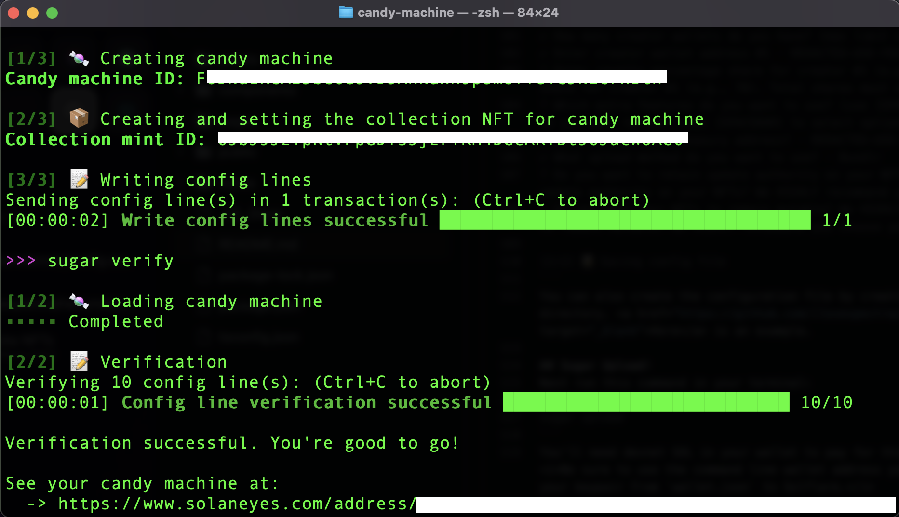

# HACKS NFT MINT UI
<a href="https://hacks-nfts.vercel.app/" target="_blank">Click here to test on devnet.</a><br />(Cost: 4 devnet SOL)<br /><br />
Swap your wallet to `devnet` within the settings of your wallet app or eztenstion. 

# Solana NFT Tutorial

### NFT minting UI for HeliumDenver HACKs NFTs.
To deploy your own version of this webpage, you'll need your own candymachine over which you retain the mint authority. Follow these steps to create your own NFT collection on Solana. 

## Installing the Solana tool suite
<b>For Mac</b><br><br>
Open the Terminal application on your Mac.
Install Homebrew, a package manager for macOS, by running the following command in the Terminal:
```
/bin/bash -c "$(curl -fsSL https://raw.githubusercontent.com/Homebrew/install/HEAD/install.sh)"
```
Once Homebrew is installed, use it to install the Solana tool suite by running the following command in the Terminal:
```
brew install solana
```
The Solana tool suite should now be installed on your Mac. To confirm, run the following command in the Terminal:
```
solana --version
```
You should see the version number of Solana printed in the Terminal.
<br><br>
<b>For Windows</b><br><br>
Download the Solana installer for Windows from the official Solana website at https://solana.com/downloads.
Run the installer and follow the on-screen instructions to install the Solana tool suite on your Windows computer.
Once the installation is complete, open the Command Prompt application on your Windows computer.
Confirm that the Solana tool suite is installed by running the following command in the Command Prompt:
```
solana --version
```
You should see the version number of Solana printed in the Command Prompt.
<br><br>
## Installing Sugar-cli `1.2.2`
<i>(There are newer versions of Sugar, but they are not compatible with my UI. If you upgrade Sugar to the latest version, you'll get a notification that your candymachine address is not a candymachine address. This was the only solution I could come up with, happy to hear suggestions though. Open a pull request!)</i><br><br> Open the Terminal or Command Prompt application on your computer.
Use the following command to install sugar-cli 1.2.2 using npm, the Node.js package manager:
```
npm install -g @solana/spl-token-cli@1.2.2
```
Once the installation is complete, you can verify that sugar-cli 1.2.2 is installed by running the following command in the Terminal or Command Prompt:
```
sugar --version
```
You should see the version number of sugar-cli printed in the Terminal or Command Prompt.

# Configure Assets
Navigate to your `assets` folder and open the `.json` files in a text editor. You'll want to modify from the following text for each asset:
```
{
    "name": "YOUR-NFT-NAME-HERE",
    "symbol": "YOUR-SYMBOL",
    "description": "Simple description.",
    "image": "0.png",
    "attributes": [
        {
            "trait_type": "Hacks Session",
            "value": "1"
        },
        {
            "trait_type": "Sensor Type",
            "value": "YOUR-SENSOR-HERE"
        },
        {
            "trait_type": "Image",
            "value": "YOUR-IMAGE"
        }
    ],
    "properties": {
        "files": [
            {
                "uri": "0.png",
                "type": "image/png"
            }
        ]
    }
}
```
## Set URL Devnet
Swap your project environment to devenet using the following command:
```
solana config set --url devnet
```
In order to create your candymachine, you'll need a command line wallet. Setup one within your project's root directory with this command:
```
solana-keygen new -o ./wallet.json
```
Be careful with this keypair, it's the same on mainnet-beta as it is on devenet, so comprimising this keypair could cost you your collection once you ship it on main!

## Create Sugar Config
Run this command to setup your Candymachine configuration file:
```
sugar create-config
```
You'll be asked a series of questions, here's my answers:
```
Check out our Candy Machine config docs to learn about the options:
  -> https://docs.metaplex.com/developer-tools/sugar/guides/configuration

✔ What is the price of each NFT? · 1
? Found 10 file pairs in "assets". Is this how many NFTs you will have in your c✔ Found 10 file pairs in "assets". Is this how many NFTs you will have in your candy machine? · yes
✔ Found symbol "HACKS" in your metadata file. Is this value correct? · yes
✔ What is the seller fee basis points? · 100
? What is your go live date? Many common formats are supported. If unsure, try YYYY-MM-DD HH:MM:SS [+/-]UTC-OFFSET or type 'now' for current time. For example 2✔ What is your go live date? Many common formats are supported. If unsure, try YYYY-MM-DD HH:MM:SS [+/-]UTC-OFFSET or type 'now' for current time. For example 2022-05-02 18:00:00 +0000 for May 2, 2022 18:00:00 UTC. · now
✔ How many creator wallets do you have? (max limit of 4) · 1
✔ Enter creator wallet address #1 · REDACTED-USE-YOUR-SOL-ADDY
? Enter royalty percentage share for creator #1 (e.g., 70). Total shares must ad✔ Enter royalty percentage share for creator #1 (e.g., 70). Total shares must add to 100. · 100
? Which extra features do you want to use? (use [SPACEBAR] to select options you wan✔ Which extra features do you want to use? (use [SPACEBAR] to select options you want and hit [ENTER] when done) · 
✔ What is your SOL treasury address? · REDACTED-USE-YOUR-SOL-ADDY
✔ What upload method do you want to use? · Bundlr
? Do you want to retain update authority on your NFTs? We HIGHLY recommend you choos✔ Do you want to retain update authority on your NFTs? We HIGHLY recommend you choose yes. · yes
? Do you want your NFTs to remain mutable? We HIGHLY recommend you choose yes. (y/n)✔ Do you want your NFTs to remain mutable? We HIGHLY recommend you choose yes. · yes

[2/2] 📝 Saving config file
```
You can also create the configuration file by creating a file named `config.json` in your projects root directory. <a href="https://github.com/ilovespectra/heliumdenver/blob/main/config.example.json" target="_blank">Here</a> is an example.

## Sugar Upload!
Next run this command in your terminal:
```
sugar upload
```
You'll need devnet SOL in your wallet to pay for this transaction. If you get an error, run this command: <i>Be sure to use the command line wallet address you just created! You can view your wallet by importing your keypair from `wallet.json` to Solflare.</i>
```
solana airdrop 2 YOUR-ADDRESS-HERE
```
Once you have SOL in your developer wallet, you should be able to proceed with `sugar upload`

## Sugar LAUNCH!

Here we go! Now that you've got some devnet SOL in your wallet, your configuration file all setup, and your assets uploaded to Arweave, you can launch your collection. It's about to get real!
<br><br>
Run this command:
```
sugar launch
```
You should see something like this:
<p align="center">

  </p>
<br><br>
I'd like to take a moment to tell you how great of a job you're doing! You just shipped your first NFT collection on Solana devnet! Pat yourself on the back, hacker.

## Setup your UI

Now all you have to do is copy that `Candymachine ID` you were just provided in your terminal, and paste it in your `components/Connected.tsx` file, in line 45:
```
  useEffect(() => {
    if (!metaplex) return

    metaplex
      .candyMachinesV2()
      .findByAddress({
        address: new PublicKey("ENTER_YOUR_CANDYMACHINE_ID_HERE"), 
      })
      .then((candyMachine) => {
        console.log(candyMachine)
        setCandyMachine(candyMachine)
      })
      .catch((error) => {
        alert(error)
      })
  }, [metaplex])
```

## Test it out!

You should be able to test things out now. Try running `npm i` and `npm run dev` in your console from your project's root directory. The project may take a moment to compile, you're installing all the node-modules. When you push this project to github it will ask if you want to add your node-modules to `.gitignore`, say YES! which will add `node_modules` to your file.
<p align="center">

  </p>

## Customize your UI

Head into `pages/index.tsx` to modify the text and images. Feel free to delete the help button, or change what it says, etc. Thanks for joining me for this tutorial. I hope you feel accomplished! If you ran into any trouble, find me on Discord or Twitter and bother me about it. This should be pretty simple, but I chewed a lot of glass to get here so I may be taking some things for granted. I'm happy to help!
